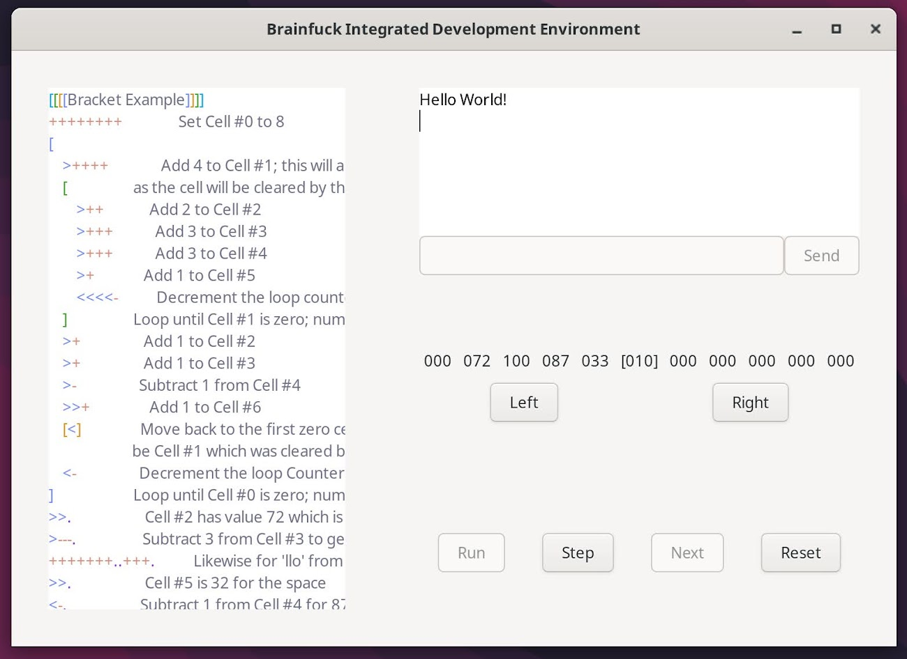

# brainfuck-interpreter-gui

## A Brainfuck Text Editor, Interpreter, and Turing Machine Simulator

An integrated development environment for the esolang brainfuck. It includes a text editor with syntax highlighting, an interpreter, debugging with breakpoints/stepping, and turing machine simulator.

This project is in fulfillment of the [CPSC 312 2024W1 project requirements](https://steven-wolfman.github.io/cpsc-312-website-2024W1/project.html).

**A note for the grader:**  Parsec was mentioned in the proposal as a means to parse and tokenise the brainfuck code, but we ended up using pure Haskell given that we didn't need the extensions that it provided for the intended behaviour of our program. We also thought it would make the interpreter code cleaner and more idiomatic.

[Proposal README](https://github.students.cs.ubc.ca/yod/brainfuck-interpreter-gui/tree/b29510c459b99c7a57cb9d143609dd2cb9eb4ab4)

## Team Members

Our team is:

+ Yod Golshani (80626666): `yod`
+ Auden Hafezi (96479712): `audenh`
+ Benjamin McPhee (16096588): `bmcphee`
+ Kevin Liu (87079844): `kliu52`
+ Shreyan Das (51692796): `dshreyan`

We call ourselves: `hooglers`

## Acknowledgments

We surely built on the work of others! Here are resources and people we got support from:

+ [Codeblocks from the Brainfuck Wikipedia page](https://en.wikipedia.org/wiki/Brainfuck) for tests and language understanding.
+ [kavehmz/brainfuck_examples](https://github.com/kavehmz/brainfuck_examples/tree/master) for tests.
+ [haskell-gi](https://github.com/haskell-gi) for a GUI. (well, bindings to a gui library more specifically)

## Video

[Our MVP Video](https://drive.google.com/file/d/1bmb5Wfqyfk52jdlCS2s2ZvibwPv23d6g/view?usp=sharing)

## Guide to MVP

Our MVP fulfills our proposal as we were able to successfully build a text editor and interpreter for Brainfuck using Haskell with all the features indicated in said proposal. Below, we've included a screenshot of our GUI for reference.

The textbox to the left is where users may input their Brainfuck code. It features syntax highlighting as shown in the the provided screenshot (the bit manipulation, memory shifting, and IO tokens are each highlighted in different colours along with the brackets being coloured dependent on depth), as well as mismatched bracket detection. After pressing the run button, users will be shown the output of their code in the textbox in the upper right, our terminal, after it has been interpreted by our backend code. Should the code request user input, this can be written in the textbox below the terminal, and submitted by pressing "Send". Below are two links to our code base that show the implementation this functionality. As the code runs, a visual representation of the tape is also dynamically updated after every instruction, with the user able to shift their view of the tape to the left and right arbitrarily far.

#### Main Brainfuck Parsing Functions:&nbsp;

https://github.students.cs.ubc.ca/yod/brainfuck-interpreter-gui/blob/6a6d36328f51d6a6af7f5c846be1091692d4e8f8/haskell/src/InterpreterBase.hs#L36-L47

https://github.students.cs.ubc.ca/yod/brainfuck-interpreter-gui/blob/6a6d36328f51d6a6af7f5c846be1091692d4e8f8/haskell/src/InterpreterBase.hs#L61-L90

#### Syntax Highlighting for brackets:&nbsp;

https://github.students.cs.ubc.ca/yod/brainfuck-interpreter-gui/blob/6a6d36328f51d6a6af7f5c846be1091692d4e8f8/haskell/src/GUITest.hs#L231-L272

We were also able to implement a Turing Machine Simulator and stepper to allow the user to better understand and investigate Brainfuck code. By pressing "Left" or "Right", the tape is shifted so that you can see different portions of it. Pressing "Step" begins the process of stepping through the code, and each click to "Next" moves the tape forward by one, updating the terminal as necessary. When a new step is completed, the tape is reset back to the index position of the actual program. This creates a visual representation of the memory tape that can be manipulated with our stepper buttons, allowing users to visualise their code at a low level.

The following two links show some of the code written to create the Turing machine tape, as well as the GUI tape viewer.

#### Tape Implementation:&nbsp;

https://github.students.cs.ubc.ca/yod/brainfuck-interpreter-gui/blob/6a6d36328f51d6a6af7f5c846be1091692d4e8f8/haskell/src/Tape.hs#L21-L52

#### Part of the code for the GUI tape viewer:&nbsp;

https://github.students.cs.ubc.ca/yod/brainfuck-interpreter-gui/blob/6a6d36328f51d6a6af7f5c846be1091692d4e8f8/haskell/src/GUITest.hs#L24-L46

## Guide to our learning

Our MVP builds on our Haskell knowledge as we used the GI.Gtk library to build a graphical user interface. Our GUI includes the use of textboxes, buttons, and dynamic text displays (the tape) that are linked to our backend, allowing users to interact with our system through a functional and clean user interface. We extended our understanding of IO functions by using them to accept user input and display results (after interpreting input code using our backend). Below we've included key code that allows our GUI to operate.

#### Implementation of GUI User Input:

https://github.students.cs.ubc.ca/yod/brainfuck-interpreter-gui/blob/6a6d36328f51d6a6af7f5c846be1091692d4e8f8/haskell/src/InterpreterGui.hs#L81-L101

#### Invoking the GUI:&nbsp;

https://github.students.cs.ubc.ca/yod/brainfuck-interpreter-gui/blob/6a6d36328f51d6a6af7f5c846be1091692d4e8f8/haskell/src/GUITest.hs#L293-L301

We also implented a Monad wrapper, to allow us to connect the frontends and backend.

#### Monad wrapper for interop with IO:&nbsp;

https://github.students.cs.ubc.ca/yod/brainfuck-interpreter-gui/blob/6a6d36328f51d6a6af7f5c846be1091692d4e8f8/haskell/src/InterpreterBase.hs#L25-L28

## How to test and run the MVP

**Ensure you have the [nix package manager](https://nixos.org/download/) and the installed or the code will not compile!**

(For Debian based systems (including WSL2), must run ``sudo apt install nix-bin`` first.)

To test the interpreter functionality, simply run `make` from the root directory or `make test` from `./haskell`.

To use the interpreter, simply run the command `stack exec brainfuck-interpreter-gui-exe -- -f <<PATH TO FILE>>` (without the `<<>>`) to open a `.bf` file or `stack exec brainfuck-interpreter-gui-exe -- -s STRING` to directly interpret a brainfuck string. (Technically you could run this through ghci, but it returns a `tape`, which is an infinite piece of data so you probably don't want to `show` that.)

To run the GUI, enter `./haskell` and run the command `stack exec brainfuck-interpreter-gui-exe -- -g` or run the command `make gui`. You can also run `stack ghci`/`make ghci`, then run `:l GUITest` followed by `run`.

Just a note: the tests using `Tasty` were removed in favour of an in-house tester written in POSIX shell script because the interpreter prints to the tty and tasty does not have a way to read from the tty without being extremely inconsistent. The equivalent `Tasty` tests do still exist and can be run with `stack test` but will undoubtably fail.

### Dependencies

|Haskell Libraries|Packages (via Nix)|
|-|-|
|base|glib|
|binary|gobject-introspection|
|containers|pcre2|
|silently|freetype|
|gi-gtk|cairo|
|freetype2|expat|
|cairo|fontconfig|
|haskell-gi-base|util-linux|
|text|harfbuzz|
|mtl|libselinux|
|gi-glib|libsepol|
|gi-gdk|pkg-config|
|gi-gobject|xorg.libXdmcp|
||gtk3|
||lerc|
||libthai|
||libdatrie|
||libxkbcommon|
||libepoxy|
||xorg.libXtst|
||libsysprof-capture|

## License

This project is licensed under the [GNU General Public License v3.0](./LICENSE).
